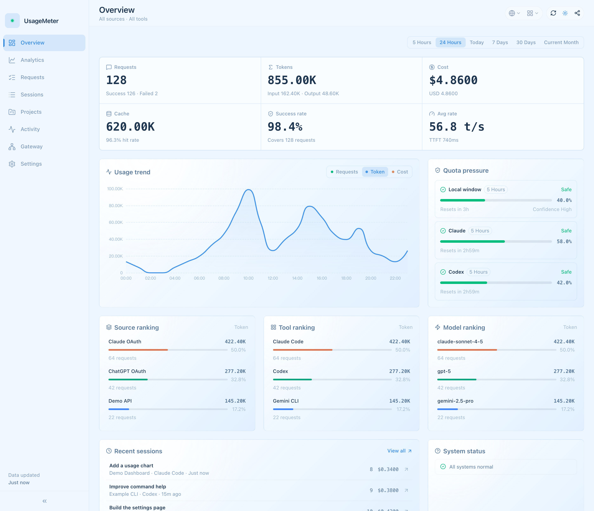
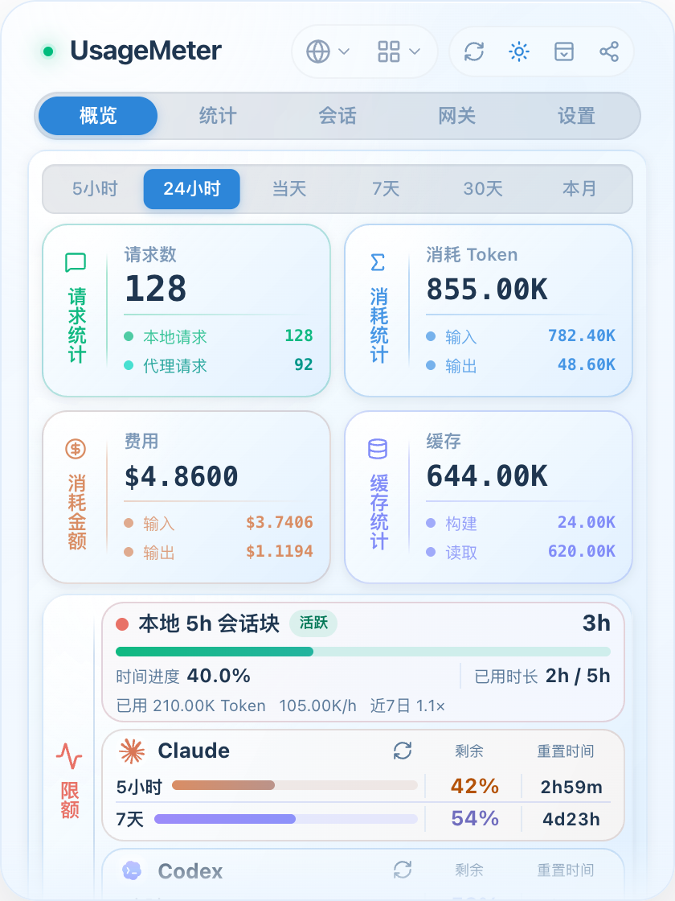
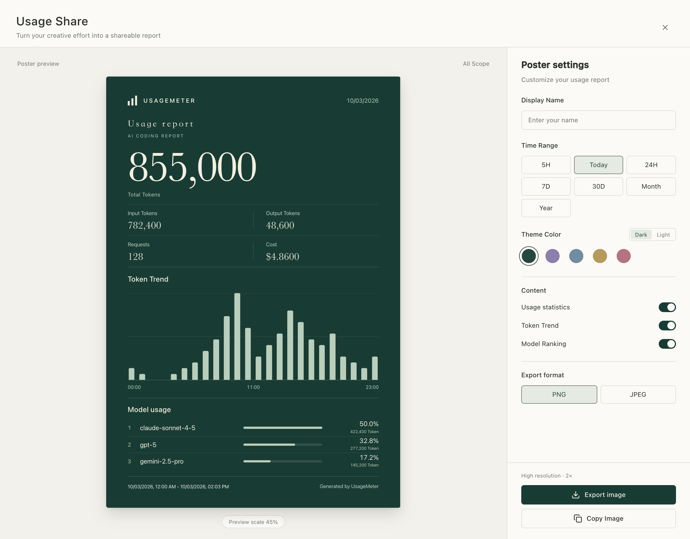
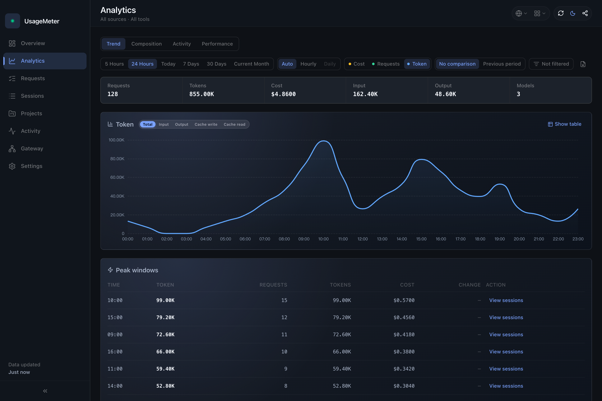
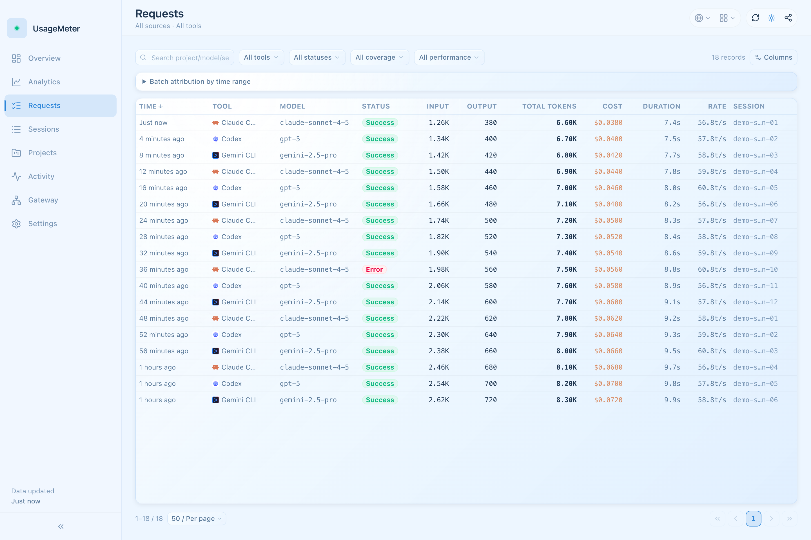
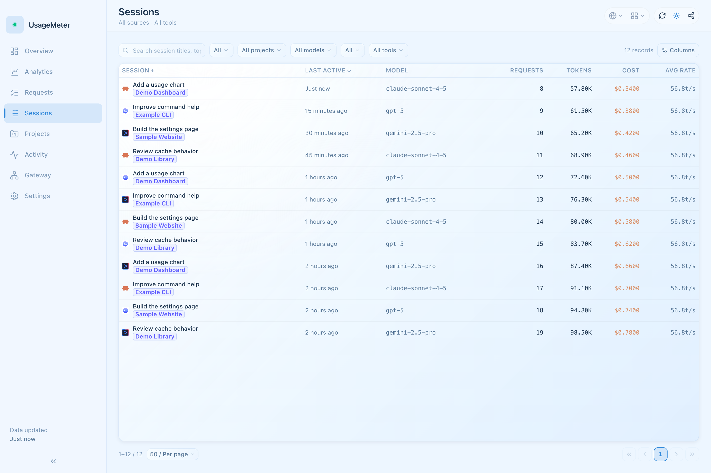
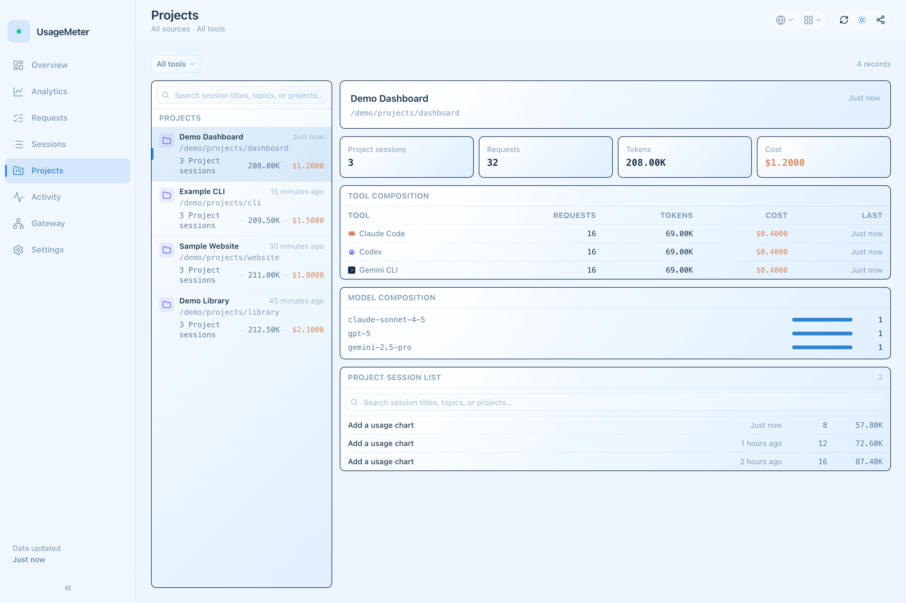
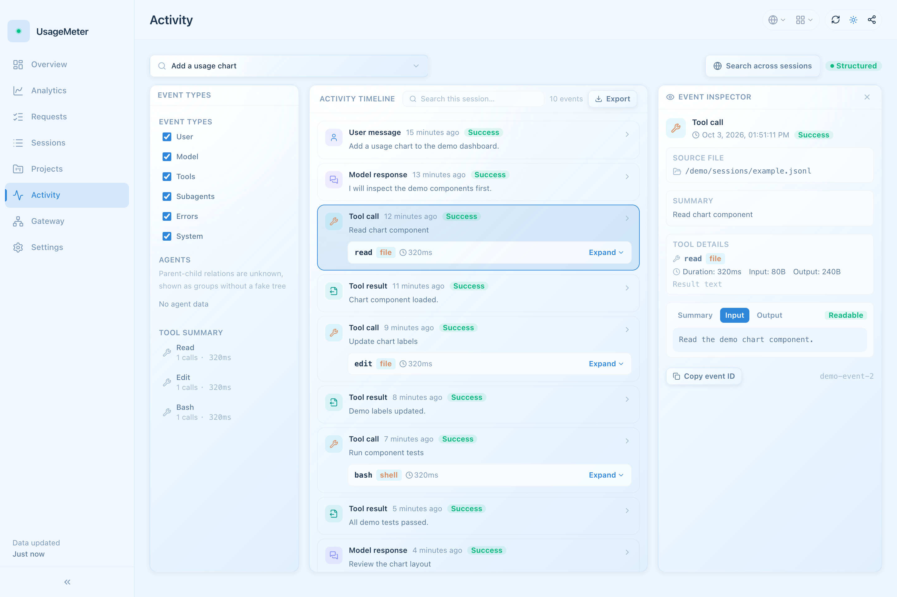

# UsageMeter

<div align="center">
  
  <p><strong>AI coding usage, quotas, and performance — from the menu bar to a full desktop workspace</strong></p>

  <p>
    
    
    
  </p>

  <p>
    <a href="README.md">English</a> | <a href="README_ZH.md">中文</a>
  </p>
</div>

UsageMeter is a local-first macOS app for understanding how your AI coding tools use tokens, requests, cache, and money. Check recent usage and quota pressure from the menu bar, then open the desktop workspace to investigate a trend, a project, a session, or an individual request.

Local history provides the baseline. Optional proxy capture adds live performance and source attribution, and the Rust backend reconciles both into one set of statistics. You can start with local scanning without configuring an API gateway or taking over a tool.

## What's New in v0.12.1

- **Worktree project attribution** with improved recognition of historical project paths.
- **Linux release support** with CI, publishing workflows, and platform-specific secret storage.
- **More reliable proxy, gateway, WebDAV sync, pricing, and currency handling.**
- **Cursor integration removed** from account sync, quota queries, local usage import, and related statistics.

See the [bilingual changelog](CHANGELOG.md) for fixes and release details.

## Screenshots

These screenshots use synthetic demo data in the current UI, with no real accounts, sessions, project paths, or credentials. The activity screenshot shows the opt-in full-text mode.The quick-panel screenshot is in Simplified Chinese; the other screenshots are in English.



<details>
<summary>View the quick panel, analytics, requests, sessions, projects, activity, and sharing</summary>

| Quick panel (Simplified Chinese) | Share editor and poster |
| :---: | :---: |
|  |  |

| Analytics · dark theme | Request explorer |
| :---: | :---: |
|  |  |

| Sessions | Projects |
| :---: | :---: |
|  |  |



</details>

## Menu Bar and Desktop Workspace

| Surface | Pages | Typical workflow |
| --- | --- | --- |
| Menu bar quick panel | Overview, Statistics, Sessions, Gateway, Settings | Check recent consumption or remaining quota without leaving your editor |
| Desktop workspace | Overview, Analytics, Sessions, Projects, Requests, Activity, Gateway, Settings | Compare periods, inspect records, follow session activity, or manage routing |
| Share window | Poster preview and export controls | Choose a period, scope, theme, and which summary sections to include |

The quick panel is `420 × 560`, hides when it loses focus, and runs without a Dock icon. Opening the desktop window adds a Dock entry for normal window switching. Linux uses a GTK/AppIndicator tray; its current backend does not emit tray click events, so open the quick panel from the tray context menu. The panel opens centered on Linux, and Wayland window managers control stacking. The tray remains available, and desktop data refreshes automatically and when the window is reopened or activated through the Dock or taskbar.

## Supported Tools and Data Sources

Support varies by capability; local usage does not imply proxy takeover or an official quota endpoint.

| Tool | Local history | Proxy takeover / capture | Official account quota |
| --- | --- | --- | --- |
| Claude Code | Yes | Yes; cc-switch coexistence protection | Claude OAuth |
| Codex CLI | Yes | Yes; cc-switch coexistence protection | ChatGPT OAuth |
| Gemini CLI | Yes | Yes; environment-based configuration | Google OAuth |
| OpenCode | Yes; JSON/SQLite schema compatibility | Yes; global configuration routes | — |
| Pi Agent | Yes | Yes; multi-provider `models.json` routes | — |
| OpenClaw | Yes | — | — |
| Hermes Agent | Yes | — | — |
| GitHub Copilot CLI | Yes | — | GitHub Copilot |
| Qoder CLI / IDE / IDE CN / Work / Work CN | Yes | — | — |
| DeepSeek Harness | Yes; configurable session root | — | — |
| Reasonix | — | Yes; global configuration | — |

Configured third-party relay sources can query quota or balance using supported query profiles. cc-switch request logs can be imported read-only, without taking over cc-switch's configuration. Deep activity currently has dedicated adapters for Claude Code and Codex.

## What You Can Inspect

### Usage and Quotas

- Requests, input/output tokens, cache writes/reads, estimated cost, and rankings by source, tool, and model.
- Overview windows for **5 hours, 24 hours, today, 7 days, 30 days, and the current month**; when a window has no data, the app can show an available fallback window with an explicit notice.
- Official quota windows, relay balances, and local consumption-rate signals. Local burn-rate projections describe recent activity; they are separate from provider-enforced limits.
- Passive attribution of supported official OAuth usage and manual attribution controls for requests, sessions, or time ranges.

### Analytics, Projects, and Requests

- Trend, composition, activity, and performance views; custom ranges, previous-period comparison, and model/project filters in desktop analytics.
- Monthly calendars and yearly heatmaps, with requests, tokens, or cost as the selected metric.
- Request pagination, search, status/coverage/performance filters, sorting, and configurable columns.
- Session and project summaries, request detail drawers, and links between requests and their sessions. Clicking a trend bucket narrows the request explorer to that period.
- Time to first token (TTFT), request duration, output-token rate, and HTTP status where the underlying records supply them.

### Deep Activity

The desktop **Activity** page follows Claude Code and Codex sessions through messages, tool invocations/results, and supported agent relationships. It links activity to request records where evidence exists, and supports session search, cross-session search, and activity export.

Deep indexing is **off by default**. In desktop **Settings**, choose structured metadata, local full-text indexing, or on-demand reading. Full-text search requires the full-text setting; content retention defaults to 90 days, and stored activity content can be purged. Availability and agent relationships depend on the adapter and original records.

### Local API Gateway

Create a profile, save its upstream credential, and connect a client using the profile's loopback endpoint and generated `umg_...` client key. The gateway supports:

| Protocol | Native API |
| --- | --- |
| OpenAI Chat Completions | `/v1/chat/completions` |
| OpenAI Responses | `/v1/responses` |
| Anthropic Messages | `/v1/messages` |
| Gemini GenerateContent | GenerateContent and streaming GenerateContent |

Profiles use public HTTPS upstreams. The gateway preserves the selected protocol and streaming responses, records supported usage and runtime metrics, and provides upstream model discovery and availability probes. Each profile has one saved upstream credential and one local client key; credentials can be replaced and local keys revoked/regenerated. Manual gateway routing and tool configuration takeover are separate controls.

Client labels are caller metadata only; a label such as `Cursor` is a generic gateway example and does not enable a built-in Cursor integration.

### Sharing and Settings

- Create a usage poster with light/dark theme presets, a custom display name, and optional statistics, trends, and model sections; copy an image or export PNG/JPEG.
- Manage model prices, custom pricing, historical price backfill, display currency, and exchange rates.
- Choose English, Simplified Chinese, or Traditional Chinese; switch appearance/palette and `K/M/B` or `万/亿` units.
- Configure refresh interval, statistical day boundaries, launch at login, update checks, and an outbound HTTP/HTTPS/SOCKS5 proxy.
- Inspect scan paths and compatibility status, rebuild local caches, clean orphaned facts, and manage optional encrypted WebDAV synchronization.

## Getting Started

1. Download a build from [Releases](https://github.com/smileslove/UsageMeter/releases), install it, and open UsageMeter. The supported release experience is macOS-first; macOS 11 or later is required.
2. Click the menu bar icon. Supported local histories are discovered from their tool-specific locations. Open **Settings** to inspect scan paths; DeepSeek Harness can use a custom session root.
3. Choose a time window and use the source/tool filters to narrow the view. Open the desktop window from the panel's toolbar for full analytics and request exploration.
4. If you need TTFT, HTTP status, or live source attribution, configure optional proxy capture or a gateway profile. Quota cards require the corresponding detected credentials or a configured relay query.
5. For deep activity, enable the desired indexing level in desktop **Settings**.

Some features appear only when their credentials or data exist. Windows-specific WSL passive scanning is available in settings, but it does not imply the same release support as macOS.

## Data, Accuracy, and Privacy

| Input | What it contributes | Important boundary |
| --- | --- | --- |
| Local files / SQLite | Historical usage, sessions, and project associations | Coverage depends on the tool's retained records and supported schema |
| Optional local proxy / gateway | Live request observations, performance, and source attribution | Tool takeover changes supported tool configuration; manual gateway clients use explicit endpoints |
| cc-switch logs | Historical request observations | Imported read-only and reconciled with other observations |

The backend merges and deduplicates observations where matching evidence is available. Missing status, performance, cost, or attribution stays unavailable rather than becoming an invented measurement. Estimated token cost uses configured model prices and is not a provider invoice or subscription charge; cache and reasoning token handling follows each reader's source semantics.

### Local Storage and Optional Network Access

UsageMeter keeps its working data under `~/.usagemeter/`:

| File | Purpose |
| --- | --- |
| `settings.json` | Stable preferences |
| `app_config.db` | Sources, tools, gateway configuration, and runtime configuration |
| `proxy_data.db` | Proxy request facts |
| `local_usage.db` | Normalized local usage, sessions, merged facts, and activity indexes |

Proxy statistics do not store prompt/response bodies or authorization headers. Session views may display titles or prompt snippets from local histories; opt-in activity modes may read or retain redacted content and full-text indexes. Review session text, project paths, source names, and account labels before sharing a screenshot or activity export.

Gateway credentials are kept in local UsageMeter configuration; legacy Keychain-backed credentials are migrated when readable, otherwise the app asks for replacement. Quota queries contact the corresponding provider; update, price, exchange-rate, and connectivity operations also use the network. Optional WebDAV sync encrypts synchronized data end to end; session text is separately configurable.

## Development

Prerequisites: Node.js `>=24`, npm `>=10`, Rust `1.94`, `clippy`, and `rustfmt`.

```bash
git clone https://github.com/smileslove/UsageMeter.git
cd UsageMeter
npm install
npm run dev:tauri
```

```bash
npm run build:tauri  # Build the desktop app
npm run lint         # TypeScript, Rust formatting, Clippy, and cargo check
npm test             # Frontend tests
cargo test --manifest-path src-tauri/Cargo.toml  # Rust tests
npm run audit        # Dependency audit
```

The browser-only `npm run dev` starts the frontend; scanning, database access, and proxy operations require the Tauri backend. Development uses a separate Tauri app identifier.

```text
src/
├── api/                 # Thin Tauri invoke wrappers
├── apps/, desktop/      # Desktop shell, pages, and navigation
├── views/, components/  # Quick panel and shared components
├── stores/              # Settings, queries, and view state
├── i18n/                # zh-CN, zh-TW, en-US
└── utils/, composables/ # Formatting and reusable UI logic
src-tauri/src/
├── commands/            # Frontend/backend contracts
├── session/, activity/  # Local readers and opt-in event indexes
├── proxy/, gateway/     # Capture, takeover, routing, and local API gateway
├── local_usage/         # SQLite facts, migrations, and materialization
├── unified_usage/       # Reconciliation, attribution, and aggregation
├── subscription/        # Provider quotas and relay balances
└── sync/, net/          # Encrypted WebDAV sync and shared HTTP clients
assets/                  # README screenshots
```

## License

[MIT](LICENSE)
