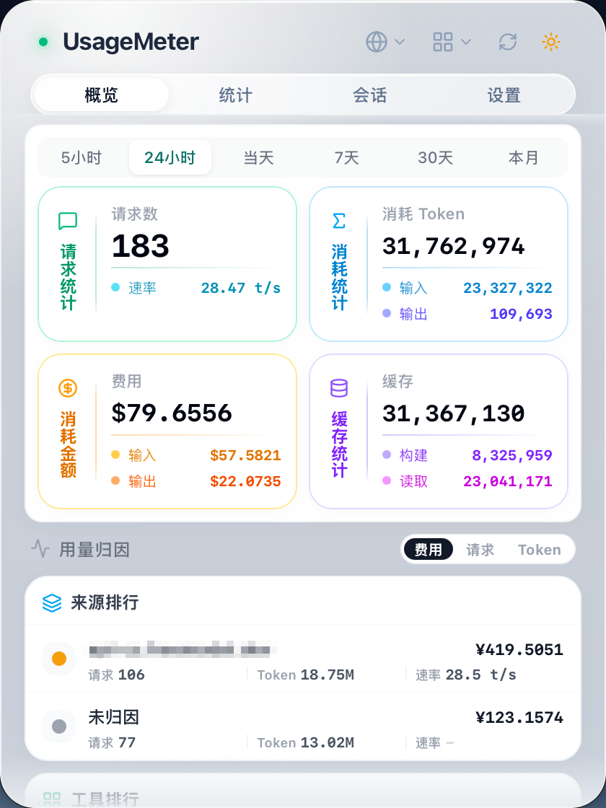
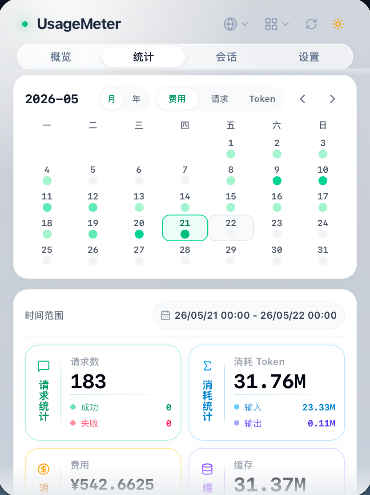
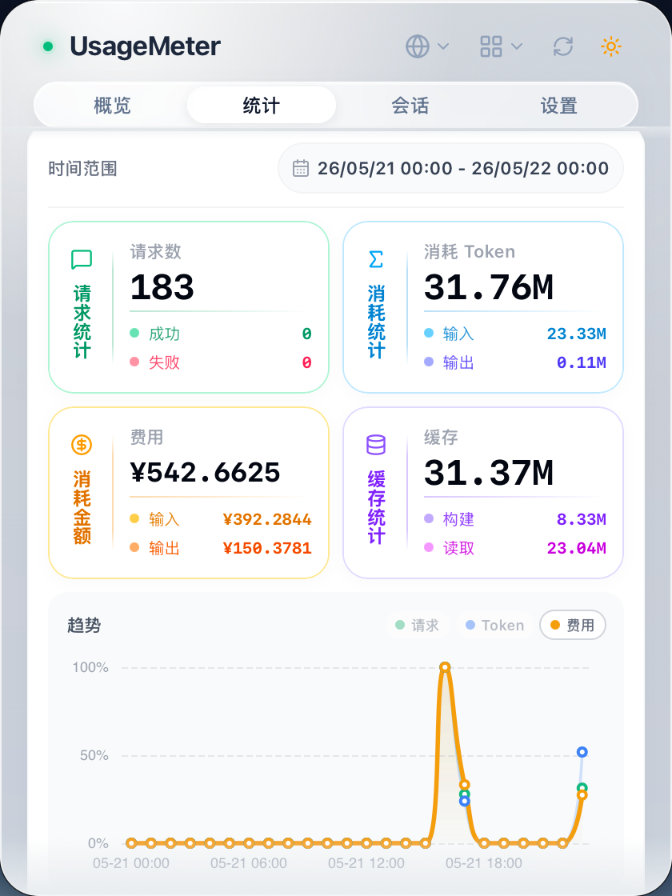
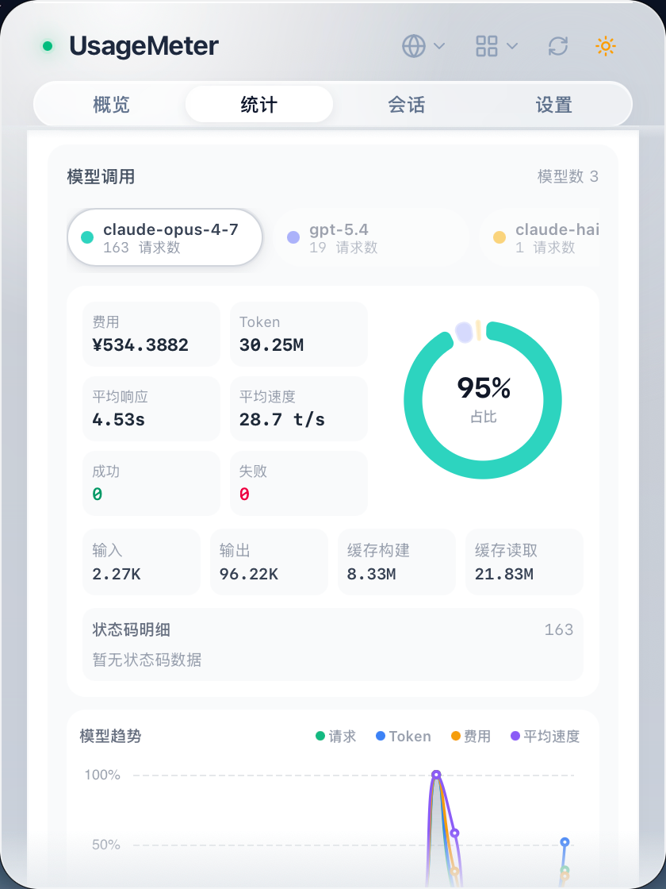
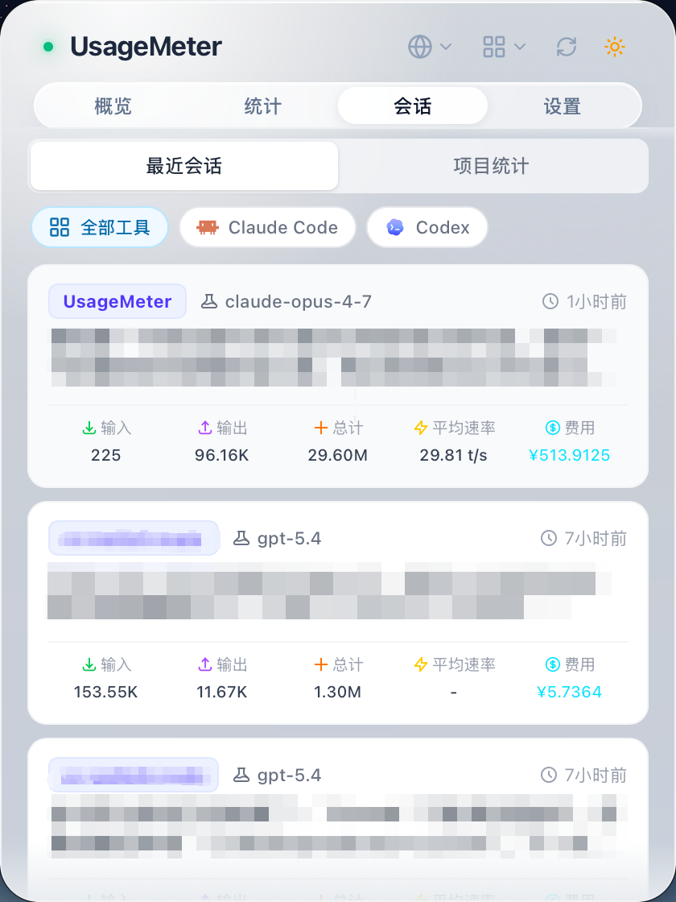
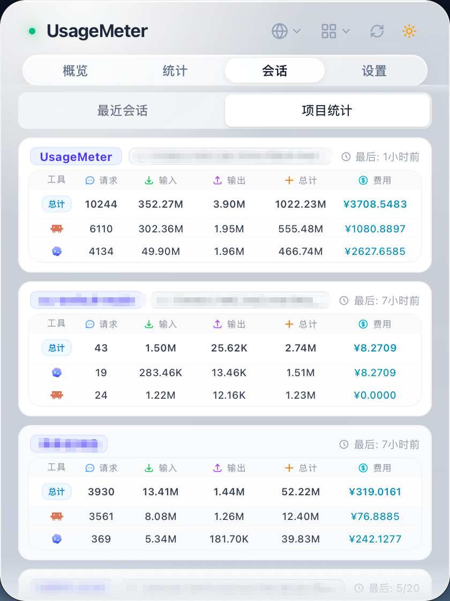

# UsageMeter

<div align="center">
  
  <p><strong>A lightweight menu bar app for observing AI coding tool usage, quotas, runtime metrics, and cost</strong></p>

  <p>
    
    
    
  </p>

  <p>
    <a href="README.md">English</a> | <a href="README_ZH.md">中文</a>
  </p>
</div>

UsageMeter is a local-first tray app built for people who use AI coding tools every day and want one place to see requests, tokens, cache usage, runtime quality, source/provider attribution, quota pressure, sessions, projects, and estimated cost.

It is designed around a compact menu bar workflow on macOS: no Dock icon, fast popup panel, low interruption, and immediate visibility into how your coding agents are consuming plans and APIs.

## Current Scope

- `macOS-first` desktop app built with Vue 3 + TypeScript + Tauri 2
- `5-panel UI`: Overview, Statistics, Sessions, Gateway, Settings
- `Local-first pipeline` with optional proxy capture and merged analytics

## Supported Tool Coverage

| Capability | Current Coverage |
| --- | --- |
| Local history scanning | Claude Code, Codex CLI, OpenClaw, OpenCode, Qoder CLI / IDE / IDE CN / Work / Work CN, Gemini CLI, GitHub Copilot CLI, Hermes Agent |
| Proxy takeover and request capture | Claude Code, Codex, OpenCode global config routes, Reasonix global config, Gemini CLI env-based config; cc-switch takeover safeguards and read-only proxy-log import |
| Local API gateway | OpenAI Chat Completions, OpenAI Responses, Anthropic Messages, and Gemini GenerateContent; one stored upstream credential and one generated local client key per profile |
| Source/provider attribution | API sources detected from proxy traffic, manual source naming, source merge/delete/key-note management, source-level filtering |
| Official or account quota queries | Codex ChatGPT OAuth, Claude, Gemini CLI, GitHub Copilot |
| Relay/provider quota queries | Configured third-party relay sources with profile-based quota or balance querying |

## What It Can Do

### Overview

- Track request count, tokens, cache tokens, and estimated cost in one compact summary card set
- Switch overview windows across `5h`, `24h`, `today`, `7d`, `30d`, and `current month`
- Show response-time and average token-rate signals when proxy runtime data exists
- Rank usage by `source`, `tool`, and `model` for the active window
- Surface a quota survival card that combines official quotas, relay balances, local burn rate, and recent usage baseline

### Statistics

- Explore rolling and calendar-based analytics for requests, tokens, cost, and model usage
- Use monthly and yearly activity views with contribution-style heatmaps
- Switch between built-in ranges and precise custom ranges
- Filter by tool and API source without leaving the main panel
- Export a styled share poster with theme presets, clipboard copy, and PNG download

### Sessions

- Browse recent sessions across supported tools
- Inspect recent proxy request records with runtime metadata
- View project-level aggregation across sessions
- Drill into session details, tokens, cost, models, and request performance

### API Gateway

- Create profiles for public HTTPS upstreams using OpenAI Chat Completions, OpenAI Responses, Anthropic Messages, or Gemini GenerateContent
- Connect clients through a profile-specific loopback endpoint and generated `umg_...` key while UsageMeter applies the stored upstream credential
- Keep streaming responses streaming while recording supported usage, runtime, and source-attribution data
- Manage manual client routing separately from tool takeover controls
- Replace the single upstream credential or revoke and regenerate the single local client key for each profile
- Recover legacy macOS Keychain-backed profiles when possible, with explicit replacement prompts on devices that cannot read the old credential

### Settings and Operations

- Enable or disable local proxy capture
- Manage tool takeover status and conflict recovery for supported tool configs
- Inspect local scan paths and OpenCode schema compatibility
- Rebuild local cache or purge orphaned local facts
- Manage model pricing, custom pricing, and historical pricing backfill
- Manage exchange rates and display currency
- Configure app-wide outbound network proxy with connectivity tests for GitHub, Anthropic, and OpenAI
- Configure encrypted WebDAV sync with device management and password rotation
- Toggle language, refresh interval, day-boundary mode, auto-start, and auto-update checks
- Configure WSL passive scan settings for Windows-oriented data discovery work
- Choose international (`K/M/B`) or Chinese (`万/亿`) number display units
- Inspect cc-switch coexistence status, reclaim a yielded takeover, and safely clean stale local proxy endpoints when cc-switch is stopped

## Data Pipeline

UsageMeter combines two collection paths:

| Mode | What it does | Best for |
| --- | --- | --- |
| Local scan | Reads supported local history files or SQLite data and stores normalized usage snapshots in a local SQLite cache | Historical usage, sessions, projects, quota windows, cost analysis |
| Local proxy | Captures live request traffic and runtime metadata through an optional local proxy | TTFT, duration, token rate, status codes, provider/source attribution |

The app merges both paths into a unified view where possible, so you can keep local history as the baseline and add runtime-only metrics when proxy mode is enabled.

The API gateway shares the local listener and sends supported native-protocol traffic through the same runtime and attribution pipeline without converting request protocols.

## Local Storage

- Stable user preferences remain in a compact local settings file
- Configurable entity collections and proxy runtime documents are stored in `app_config.db`
- Normalized local usage, session facts, and synchronization state remain in the local usage SQLite database
- Gateway credentials stay in local UsageMeter configuration; legacy macOS Keychain references are migrated or surfaced for manual recovery

## Screenshots

|          |  |  |
| :--------------------------------------------: | :----------------------------------------------: | :----------------------------------------------------------: |
|                _Overview Panel_                |                _Activity Heatmap_                |                   _Time Window Statistics_                   |
|  |    |          |
|                 _Model Usage_                  |                _Recent Sessions_                 |                     _Project Statistics_                     |

## Installation

Download the latest build from the [Releases](https://github.com/smileslove/UsageMeter/releases) page.

### Runtime Requirements

- macOS 11 or later
- At least one supported AI coding tool if you want live local or proxy data

### Notes

- The product is currently optimized for the macOS menu bar experience
- Some Windows-oriented settings already exist, such as WSL scan support, but the shipping experience remains macOS-first
- Some features only appear when the related tool credentials or local data are detected

## Development

### Prerequisites

- Node.js `>= 24`
- npm `>= 10`
- Rust toolchain `1.94` with `clippy` and `rustfmt`

### Run Locally

```bash
git clone https://github.com/smileslove/UsageMeter.git
cd UsageMeter
npm install
npm run dev:tauri
```

### Build

```bash
npm run build:tauri
```

### Validation

```bash
npm run lint
```

This runs:

- `vue-tsc --noEmit`
- `cargo fmt -- --check`
- `cargo clippy -- -D warnings`
- `cargo check`

## Project Structure

```text
UsageMeter/
├── src/                    # Vue frontend
│   ├── components/         # Reusable UI components
│   ├── views/              # Overview / Statistics / Sessions / Gateway / Settings
│   ├── stores/             # Pinia state
│   ├── i18n/               # Localization
│   └── utils/              # Formatting and UI helpers
├── src-tauri/              # Tauri backend
│   └── src/
│       ├── app_config.rs   # Configurable entity storage and runtime documents
│       ├── commands/       # Tauri command surface
│       ├── gateway/        # Local API gateway domain, audit, and rate limiting
│       ├── session/        # Local readers for supported tools
│       ├── proxy/          # Proxy capture, takeover, routing
│       ├── local_usage/    # Local usage SQLite cache
│       ├── unified_usage/  # Merged local + proxy analytics
│       ├── subscription/   # Quota and balance query logic
│       ├── sync/           # WebDAV encrypted sync
│       └── net/            # Shared HTTP client and network proxy support
├── assets/                 # README screenshots and media
└── doc/                    # Product and architecture documents
```

## License

MIT
