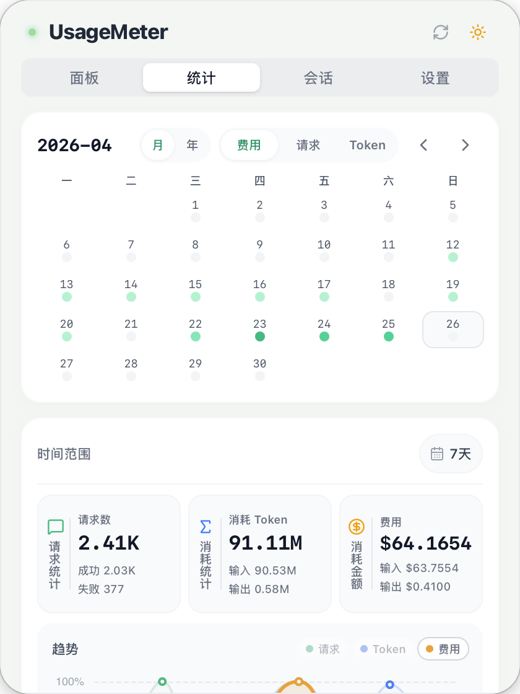
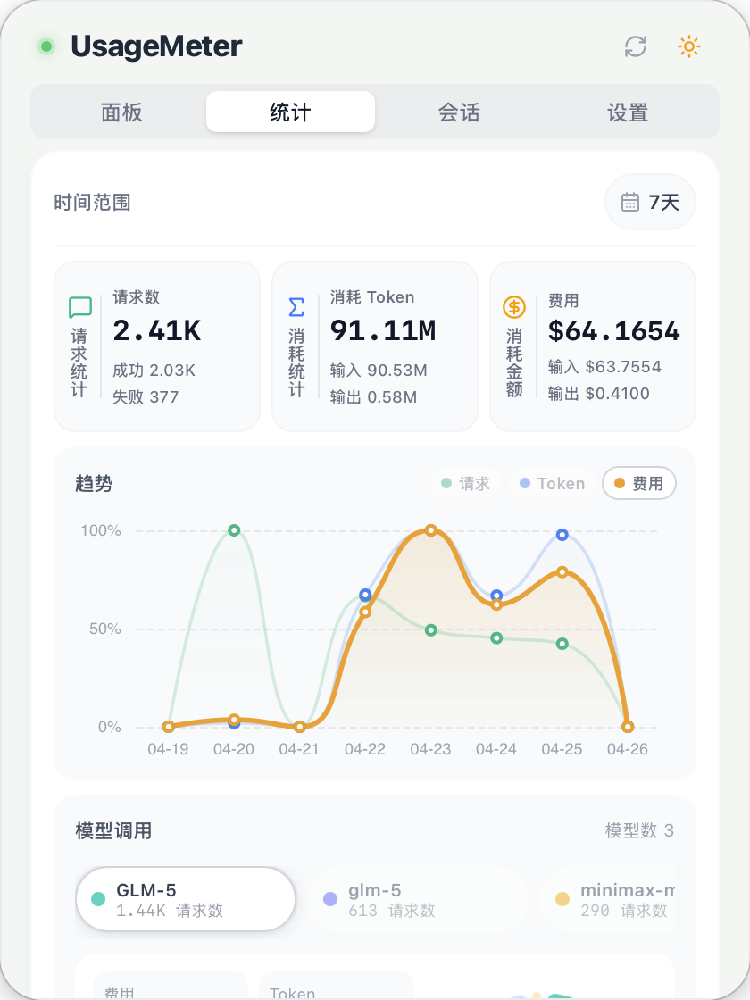
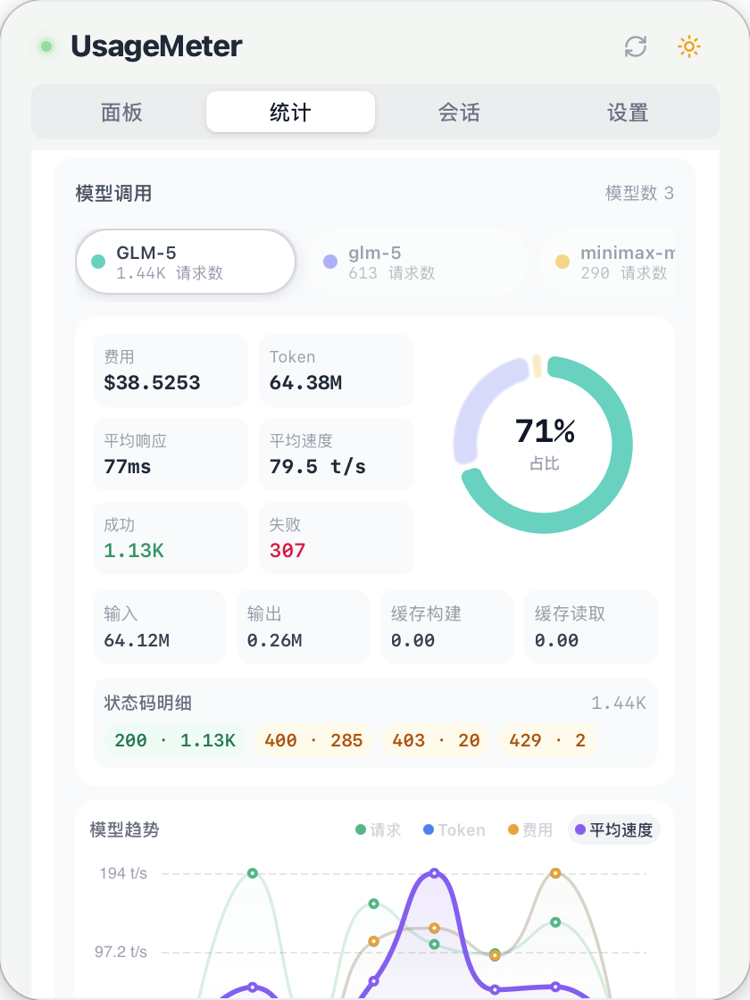
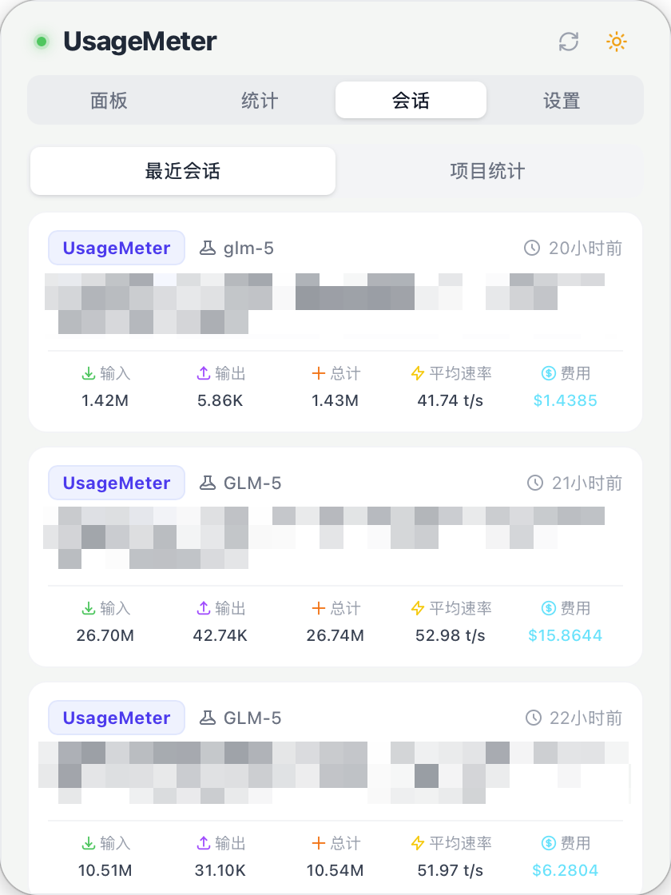
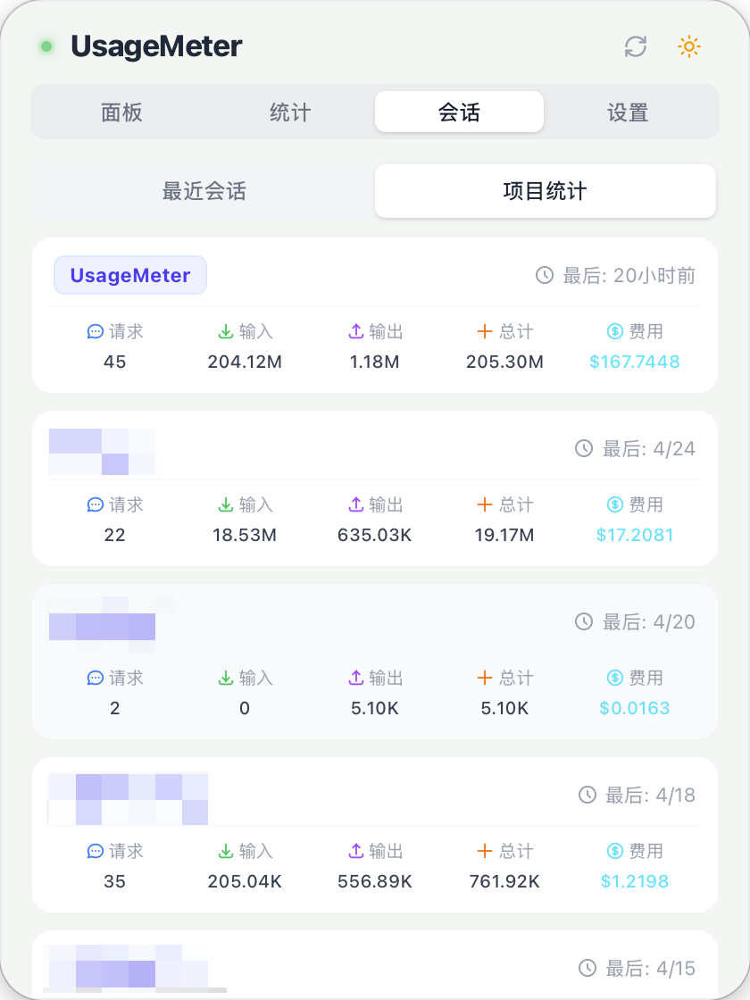

# UsageMeter

<div align="center">
  
  <p><strong>一款用于监控大模型使用情况的菜单栏应用</strong></p>


  <p>
    
    
  </p>

  <p>
    <a href="README.md">English</a> | <a href="README_ZH.md">中文</a>
  </p>
</div>


> 本项目基于AI工具开发，欢迎交流并参与贡献。
>
> 🎯 **为什么开发 UsageMeter？**
>
> 在使用国内大模型 Coding Plan 时，我发现部分套餐基于请求次数计费，但市面上缺乏能够完整统计大模型使用情况的工具。于是，我开发了 UsageMeter —— 一款专注于统计请求次数、Token 使用量、Token 生成速率和额度使用情况的轻量级监控应用。
>
> 本人学生党，目前使用 Claude Code 进行日常开发。本项目以 Claude Code 为主要测试对象，后续计划支持更多 Coding Plan 和 AI 编程工具。

---

## 功能特性

### ✅ 已实现

- 📊 **实时使用监控** - 实时追踪 Claude Code 的 Token 使用量和请求次数
- 🎯 **多时间窗口统计** - 支持 5 小时、24 小时、7 天、月度等多维度使用统计
- 🌐 **代理模式** - 可选本地代理，实现更精准的实时追踪
- 🌍 **国际化支持** - 支持中文和英文界面
- ⚙️ **灵活配额设置** - 为不同时间窗口配置独立的限额与警告阈值
- 💵 **费用估算** - 同步开源模型价格库、添加自定义价格，并按模型估算使用费用
- 📈 **统计仪表盘** - 分析请求数、Token、费用、模型分布、趋势、状态码和活跃热力图
- 💬 **会话与项目分析** - 浏览最近会话、项目汇总、Token 使用、费用和代理模式下的性能指标
- 🚀 **开机启动与原生托盘体验** - 支持登录后自动启动、跟随系统主题，并以轻量菜单栏应用运行

### 🚧 计划中

- 🛠️ **多工具支持** - 扩展支持其他 AI 编程助手（如 Cursor、Copilot 等）
- 🪟 **Windows 支持** - 适配 Windows 10/11 平台
- ☁️ **WebDAV 同步** - 跨设备同步设置与数据，汇总多设备使用情况
- 📋 **Claude Pro 支持** - 支持 Claude Pro 订阅等具有用量查询API的用量查询与监控

---

## 截图

|  |  |  |
|:---:|:---:|:---:|
| *概览面板* | *活跃度热力图* | *时间范围统计* |
|  |  |  |
| *模型调用* | *最近会话* | *项目统计* |

## 安装

### 下载

从 [Releases](https://github.com/smileslove/UsageMeter/releases) 页面下载最新版本。

### 系统要求

- macOS 11.0 (Big Sur) 或更高版本
- 已安装 Claude Code

## 使用方法

1. 启动 UsageMeter
2. 应用将显示在菜单栏中
3. 点击菜单栏图标打开控制面板
4. 在设置中配置您的配额限制

### 数据采集模式

UsageMeter 支持两种数据采集策略：

| 模式 | 说明 | 功能差异 |
|------|------|---------|
| **ccusage + 本地文件** | 默认模式。优先使用 ccusage，必要时自动回退到本地 JSONL 解析 | 支持配额窗口、Token/请求统计、模型分布、费用估算、会话和项目汇总 |
| **本地代理** | 通过本地 Anthropic 兼容代理采集请求数据 | 额外支持生成速率、TTFT、状态码、请求耗时和代理侧请求记录等实时性能数据 |

> **提示**：
> - 本地文件模式是默认模式，已经可以覆盖大多数历史 Token、请求、会话、项目和费用统计。
> - 代理模式会为同一套视图补充 JSONL 中没有的运行时指标，例如生成速率、TTFT、响应时间和状态码分布。
> - 费用估算使用同步的开源模型价格库和用户自定义价格；自定义价格优先级更高。

## 开发

### 环境要求

- [Node.js](https://nodejs.org/) 20+
- [Rust](https://www.rust-lang.org/) 1.70+
- [pnpm](https://pnpm.io/) 或 npm

### 快速开始

```bash
# 克隆仓库
git clone https://github.com/smileslove/UsageMeter.git
cd UsageMeter
# 安装依赖
npm install
# 开发模式运行
npm run dev:tauri
# 生产构建
npm run build:tauri
```

### 提交前验证

提交前请运行 lint 脚本确保所有检查通过（与 CI 流程一致）：

```bash
npm run lint
```

该脚本会依次执行：
- TypeScript 类型检查 (`vue-tsc --noEmit`)
- Rust 格式检查 (`cargo fmt -- --check`)
- Rust clippy 静态分析 (`cargo clippy -- -D warnings`)
- Rust 编译检查 (`cargo check`)

### 项目结构

```
UsageMeter/
├── src/                    # Vue 前端
│   ├── assets/             # 静态资源
│   ├── components/         # 可复用 UI 组件
│   │   └── statistics/     # 统计仪表盘组件
│   ├── views/              # 面板视图（概览、统计、会话、设置）
│   ├── stores/             # Pinia 状态管理
│   ├── utils/              # 前端格式化工具
│   └── i18n/               # 国际化
├── src-tauri/              # Tauri/Rust 后端
│   └── src/
│       ├── commands/       # Tauri 命令
│       ├── models/         # 数据模型
│       ├── proxy/          # 代理服务器实现
│       ├── session/        # 本地 JSONL 会话元信息扫描
│       └── utils/          # 工具函数
├── scripts/                # 构建脚本
└── assets/                 # 文档截图等资源
```

## 数据库设计

UsageMeter 使用 SQLite 存储代理请求记录、聚合统计和模型价格数据，数据库文件位于 `~/.usagemeter/proxy_data.db`。本地文件模式还会直接读取 Claude Code JSONL 文件，用于会话元信息和历史用量统计。

### 核心数据表

#### `usage_records` - 使用记录表

存储代理侧单次请求数据：

| 字段 | 类型 | 说明 |
|------|------|------|
| `id` | INTEGER | 主键 |
| `timestamp` | INTEGER | 请求时间戳（毫秒） |
| `message_id` | TEXT | 消息唯一标识 |
| `input_tokens` / `output_tokens` | INTEGER | 输入和输出 Token 数 |
| `cache_create_tokens` / `cache_read_tokens` | INTEGER | 缓存写入/读取 Token 数 |
| `model` | TEXT | 模型名称 |
| `session_id` | TEXT | 会话 ID |
| `request_start_time` / `request_end_time` | INTEGER | 请求开始/结束时间 |
| `duration_ms` / `ttft_ms` | INTEGER | 请求耗时和首 Token 生成时间 |
| `output_tokens_per_second` | REAL | 输出 Token 生成速率 |
| `status_code` | INTEGER | HTTP 响应状态码 |
| `estimated_cost` | REAL | 写入或回填时冻结的估算费用 |
| `pricing_snapshot_id` | TEXT | 价格快照引用 |
| `cost_locked` | INTEGER | 费用是否已冻结 |

> **注意**：数据库不冗余存储 `total_tokens`。总量按 `input_tokens + cache_create_tokens + cache_read_tokens + output_tokens` 动态计算；费用计算会保留四类 Token 的独立价格，因为缓存 Token 可能具有不同单价。

#### `session_stats` - 会话性能统计表

存储代理模式特有的会话聚合数据，并在界面中与本地 JSONL 会话元信息合并展示：

| 字段 | 说明 |
|------|------|
| `session_id` | 主键 |
| `total_duration_ms`, `avg_output_tokens_per_second`, `avg_ttft_ms` | 性能指标 |
| `proxy_request_count`, `success_requests`, `error_requests` | 请求计数 |
| `total_input_tokens`, `total_output_tokens`, `total_cache_create_tokens`, `total_cache_read_tokens` | 代理侧 Token 汇总 |
| `models`, `first_request_time`, `last_request_time` | 会话模型和时间范围 |
| `estimated_cost`, `last_updated` | 费用和更新时间 |

#### `daily_summary` - 每日汇总表

用于加速历史按日聚合查询：

| 字段 | 类型 | 说明 |
|------|------|------|
| `date` | TEXT | 日期（主键） |
| `total_tokens` / Token 分类字段 | INTEGER | 总 Token 和各分类 Token 数 |
| `request_count` | INTEGER | 请求次数 |
| `cost` | REAL | 总估算费用 |
| `success_*` 字段 | INTEGER / REAL | 成功请求的 Token 和费用聚合 |
| `model_count` | INTEGER | 当日使用模型数量 |
| `success_requests` / `client_error_requests` / `server_error_requests` | INTEGER | 按状态类别统计的请求数 |
| `finalized_at` | INTEGER | 历史聚合固化时间 |

#### `model_usage` - 模型使用量表

按日期和模型分组统计：

| 字段 | 类型 | 说明 |
|------|------|------|
| `date` | TEXT | 日期（联合主键） |
| `model` | TEXT | 模型名称（联合主键） |
| `total_tokens` / Token 分类字段 | INTEGER | 总 Token 和各分类 Token 数 |
| `request_count` | INTEGER | 请求次数 |
| `cost` | REAL | 估算费用 |
| `success_requests` / `client_error_requests` / `server_error_requests` | INTEGER | 按状态类别统计的请求数 |

#### `model_pricing` - 模型价格表

缓存同步的开源模型价格和用户自定义价格：

| 字段 | 说明 |
|------|------|
| `model_id`, `display_name` | 模型标识和显示名称 |
| `input_price`, `output_price` | 每百万输入/输出 Token 单价 |
| `cache_read_price`, `cache_write_price` | 可选的缓存 Token 单价 |
| `source` | `api` 或 `custom` |
| `last_updated` | 最后更新时间 |

### 配置存储

应用配置以 JSON 格式存储于 `~/.usagemeter/settings.json`，包含：

- 语言、时区设置
- 刷新间隔
- 警告/危险阈值
- 计费类型（token/request/both）
- `5h`、`24h`、`today`、`7d`、`30d`、`current_month` 等时间窗口配额
- 汇总展示窗口和数据源（`ccusage` 或 `proxy`）
- 代理端口、代理自启动策略以及是否统计错误请求
- 主题设置和登录后自动启动
- 模型价格匹配方式、最后同步时间和自定义价格覆盖配置

## 技术栈

- **前端**: Vue 3 + TypeScript + Vite + Tailwind CSS + Pinia + ECharts / vue-echarts
- **后端**: Tauri 2.x (Rust)，支持托盘图标、开机自启动、本地代理和原生窗口控制
- **数据**: ccusage、本地 Claude Code JSONL 解析、SQLite (`rusqlite`) 以及同步/自定义模型价格
- **代理运行时**: Tokio + Hyper + Reqwest，用于本地 Anthropic 兼容请求转发

## 参与贡献

欢迎交流并参与贡献！请随时提交 Pull Request。

## 致谢

> 这里在实现时，参考了一些已有工具的相关实现

- [ryoppippi/ccusage](https://github.com/ryoppippi/ccusage) - 一款从本地 JSONL 文件分析 Claude Code/Codex CLI 使用情况的命令行工具。
- [farion1231/cc-switch](https://github.com/farion1231/cc-switch) - 一款面向 Claude Code、Codex、OpenCode、OpenClaw 和 Gemini 命令行工具的跨平台桌面一站式辅助工具。
- [sj719045032/claude-statistics](https://github.com/sj719045032/claude-statistics) - 一款用于监控 Claude Code 使用情况、会话统计数据及费用明细的 macOS 菜单栏应用。
- [anomalyco/models.dev](https://github.com/anomalyco/models.dev) - 一个开源的 AI 模型数据库。

## 许可证

本项目基于 MIT 许可证开源 - 详见 [LICENSE](LICENSE) 文件。

---

<div align="center">
  由 <a href="https://github.com/smileslove">Smileslove</a> 制作
</div>
