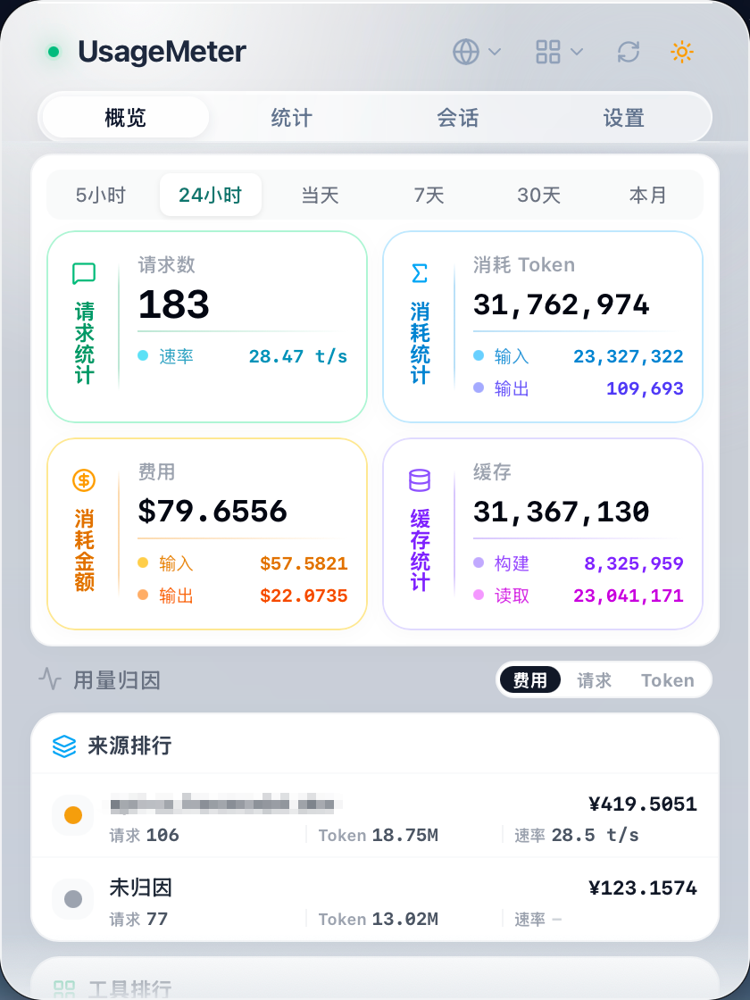

# UsageMeter

<div align="center">
  
  <p><strong>一款用于监控大模型使用情况的菜单栏应用</strong></p>


  <p>
    
    
  </p>

  <p>
    <a href="README.md">English</a> | <a href="README_ZH.md">中文</a>
  </p>
</div>


> 本项目基于AI工具开发，欢迎交流并参与贡献。
>
> 🎯 **为什么开发 UsageMeter？**
>
> 在使用国内大模型 Coding Plan 时，我发现部分套餐基于请求次数计费，但市面上缺乏能够完整统计大模型使用情况的工具。于是，我开发了 UsageMeter —— 一款专注于统计请求次数、Token 使用量、Token 生成速率和额度使用情况的轻量级监控应用。
>
> 本人学生党，目前使用 Claude Code 进行日常开发。本项目以 Claude Code 为主要测试对象，后续计划支持更多 Coding Plan 和 AI 编程工具。

---

## 功能特性

### ✅ 已实现

- 📊 **实时使用监控** - 实时追踪 Claude Code 的 Token 使用量和请求次数
- 🎯 **多时间窗口统计** - 支持 5 小时、24 小时、7 天、月度等多维度使用统计
- 🌐 **代理模式** - 可选本地代理，实现更精准的实时追踪
- 🌍 **国际化支持** - 支持中文和英文界面
- ⚙️ **灵活配额设置** - 为不同时间窗口配置独立的限额与警告阈值

### 🚧 计划中

- 📈 **统计仪表盘** - 使用趋势折线图、模型分布环形图、每日贡献热力图等
- 💬 **会话管理** - 浏览和分析单个对话会话详情、Token 使用情况和生成速率
- 🛠️ **多工具支持** - 扩展支持其他 AI 编程助手（如 Cursor、Copilot 等）
- 🪟 **Windows 支持** - 适配 Windows 10/11 平台
- ☁️ **WebDAV 同步** - 跨设备同步设置与数据，汇总多设备使用情况
- 📋 **Claude Pro 支持** - 支持 Claude Pro 订阅等具有用量查询API的用量查询与监控

---

## 截图

<div align="center">
  
  <br>
  <em>概览面板</em>
</div>
> 统计分析面板与会话面板正在开发中


## 安装

### 下载

从 [Releases](https://github.com/smileslove/UsageMeter/releases) 页面下载最新版本。

### 系统要求

- macOS 11.0 (Big Sur) 或更高版本
- 已安装 Claude Code

## 使用方法

1. 启动 UsageMeter
2. 应用将显示在菜单栏中
3. 点击菜单栏图标打开控制面板
4. 在设置中配置您的配额限制

### 数据采集模式

UsageMeter 支持两种数据采集策略：

| 模式 | 说明 | 功能差异 |
|------|------|---------|
| **ccusage + 本地文件** | 默认模式。优先使用 ccusage 工具解析数据（需具有node环境），失败时自动回退到本地日志解析 | 基础统计和模型分布功能完整 |
| **本地代理** | 通过本地代理实时采集数据 | 支持**生成速率、状态码**等实时统计 |

> **提示**：
> - 两种模式均支持基础 Token 统计和模型分布功能
> - 本地代理模式提供更丰富的实时数据（生成速率、响应时间、状态码分布等）
> - **费用统计功能**正在开发中，后续将支持在设置中配置各模型价格信息

## 开发

### 环境要求

- [Node.js](https://nodejs.org/) 20+
- [Rust](https://www.rust-lang.org/) 1.70+
- [pnpm](https://pnpm.io/) 或 npm

### 快速开始

```bash
# 克隆仓库
git clone https://github.com/smileslove/UsageMeter.git
cd UsageMeter
# 安装依赖
npm install
# 开发模式运行
npm run dev:tauri
# 生产构建
npm run build:tauri
```

### 项目结构

```
UsageMeter/
├── src/                    # Vue 前端
│   ├── assets/             # 静态资源
│   ├── components/         # 可复用 UI 组件
│   ├── views/              # 面板视图（概览、统计、会话、设置）
│   ├── stores/             # Pinia 状态管理
│   └── i18n/               # 国际化
├── src-tauri/              # Tauri/Rust 后端
│   └── src/
│       ├── commands/       # Tauri 命令
│       ├── models/         # 数据模型
│       ├── proxy/          # 代理服务器实现
│       └── utils/          # 工具函数
├── scripts/                # 构建脚本
└── assets/                 # 文档截图等资源
```

## 数据库设计

UsageMeter 使用 SQLite 存储代理模式下的使用数据，数据库文件位于 `~/.usagemeter/proxy_data.db`。

### 核心数据表

#### `usage_records` - 使用记录表

存储每次 API 请求的详细数据：

| 字段 | 类型 | 说明 |
|------|------|------|
| `id` | INTEGER | 主键 |
| `timestamp` | INTEGER | 请求时间戳（毫秒） |
| `message_id` | TEXT | 消息唯一标识 |
| `input_tokens` | INTEGER | 输入 Token 数 |
| `output_tokens` | INTEGER | 输出 Token 数 |
| `cache_create_tokens` | INTEGER | 缓存创建 Token 数 |
| `cache_read_tokens` | INTEGER | 缓存读取 Token 数 |
| `model` | TEXT | 模型名称 |
| `session_id` | TEXT | 会话 ID |
| `duration_ms` | INTEGER | 请求耗时（毫秒） |
| `output_tokens_per_second` | REAL | 生成速率（tokens/s） |
| `ttft_ms` | INTEGER | 首 Token 生成时间 |
| `status_code` | INTEGER | HTTP 状态码 |

> **注意**：不存储 `total_tokens` 字段，因为四种 Token 价格不同，简单相加无意义。实际处理量 = `input_tokens` + `output_tokens`。

#### `daily_summary` - 每日汇总表

用于加速按日聚合查询：

| 字段 | 类型 | 说明 |
|------|------|------|
| `date` | TEXT | 日期（主键） |
| `total_tokens` | INTEGER | 总 Token 数 |
| `input_tokens` | INTEGER | 输入 Token 数 |
| `output_tokens` | INTEGER | 输出 Token 数 |
| `cache_create_tokens` | INTEGER | 缓存创建 Token 数 |
| `cache_read_tokens` | INTEGER | 缓存读取 Token 数 |
| `request_count` | INTEGER | 请求次数 |

#### `model_usage` - 模型使用量表

按日期和模型分组统计：

| 字段 | 类型 | 说明 |
|------|------|------|
| `date` | TEXT | 日期（联合主键） |
| `model` | TEXT | 模型名称（联合主键） |
| `total_tokens` | INTEGER | 总 Token 数 |
| `input_tokens` | INTEGER | 输入 Token 数 |
| `output_tokens` | INTEGER | 输出 Token 数 |
| `request_count` | INTEGER | 请求次数 |

### 配置存储

应用配置以 JSON 格式存储于 `~/.usagemeter/settings.json`，包含：

- 语言、时区设置
- 刷新间隔
- 警告/危险阈值
- 计费类型（token/request/both）
- 各时间窗口配额限制
- 代理配置
- 主题设置

## 技术栈

- **前端**: Vue 3 + TypeScript + Tailwind CSS + ECharts
- **后端**: Tauri 2.x (Rust)

## 参与贡献

欢迎交流并参与贡献！请随时提交 Pull Request。

## 致谢

> 这里在实现时，参考了一些已有工具的相关实现

- [ryoppippi/ccusage](https://github.com/ryoppippi/ccusage) - 一款从本地 JSONL 文件分析 Claude Code/Codex CLI 使用情况的命令行工具。
- [farion1231/cc-switch](https://github.com/farion1231/cc-switch) - 一款面向 Claude Code、Codex、OpenCode、OpenClaw 和 Gemini 命令行工具的跨平台桌面一站式辅助工具。
- [sj719045032/claude-statistics](https://github.com/sj719045032/claude-statistics) - 一款用于监控 Claude Code 使用情况、会话统计数据及费用明细的 macOS 菜单栏应用。
- [anomalyco/models.dev](https://github.com/anomalyco/models.dev) - 一个开源的 AI 模型数据库。

## 许可证

本项目基于 MIT 许可证开源 - 详见 [LICENSE](LICENSE) 文件。

---

<div align="center">
  由 <a href="https://github.com/smileslove">Smileslove</a> 制作
</div>
