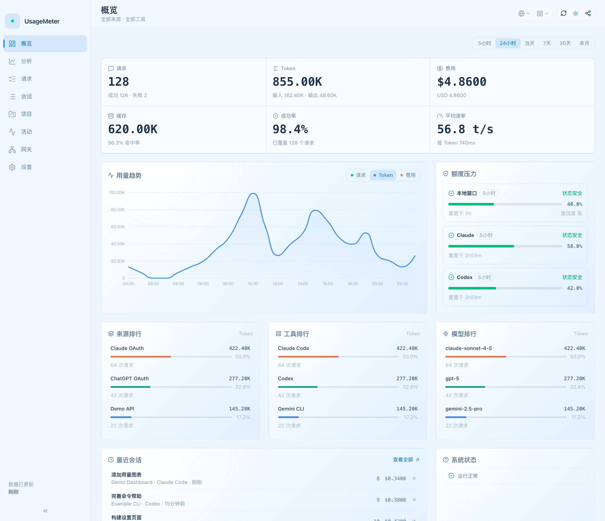
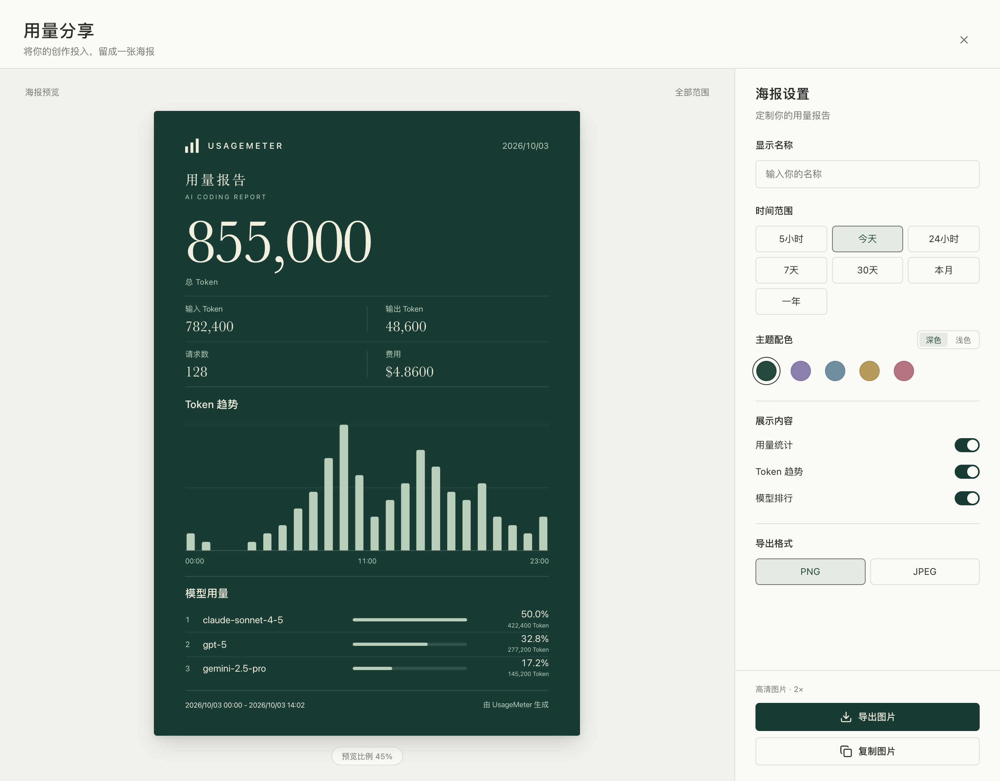
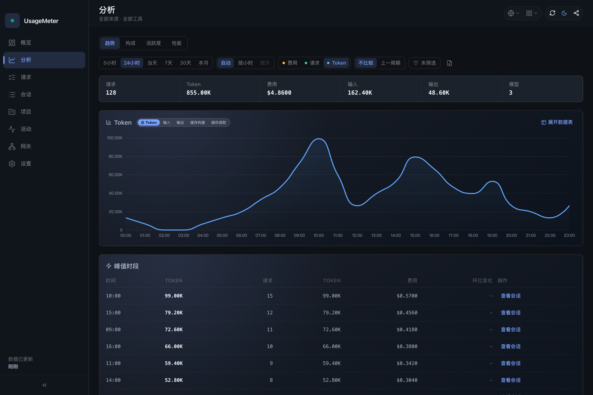
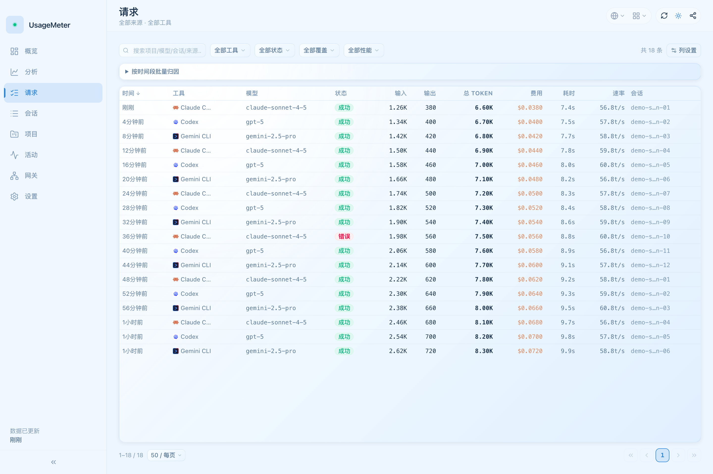
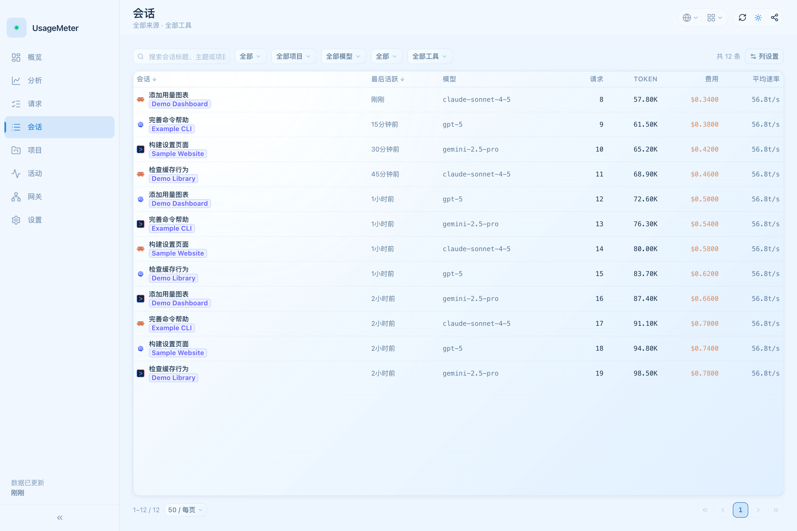
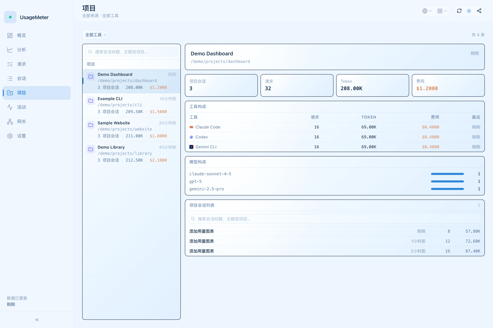
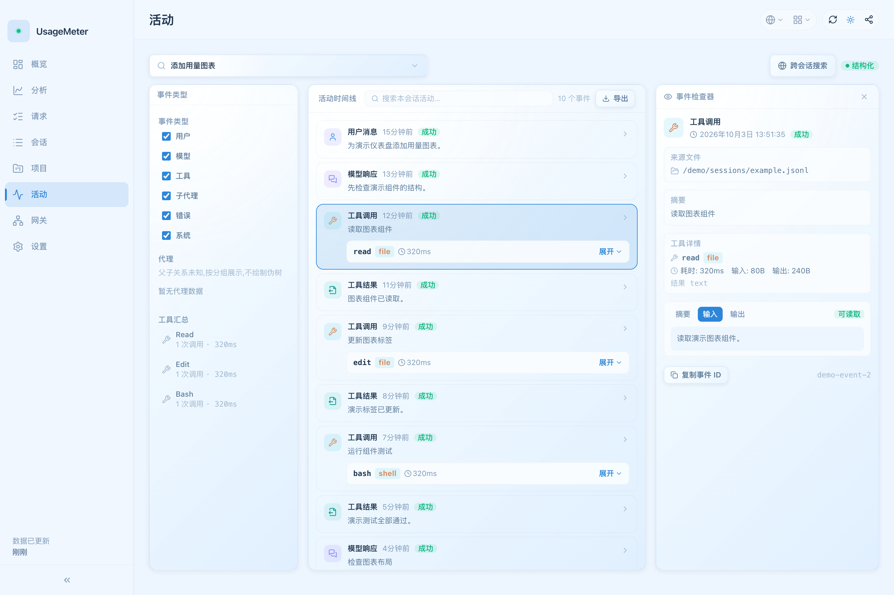

# UsageMeter

<div align="center">
  
  <p><strong>从菜单栏到桌面工作区，集中查看 AI 编程用量、额度与性能</strong></p>

  <p>
    
    
    
  </p>

  <p>
    <a href="README.md">English</a> | <a href="README_ZH.md">中文</a>
  </p>
</div>

UsageMeter 是一款 macOS 本地优先应用，用来了解 AI 编程工具消耗了多少 Token、请求、缓存与费用。日常从菜单栏查看近期用量和额度压力，需要追查某次峰值、项目、会话或请求时，再打开完整桌面工作区。

本地历史提供统计基线，可选代理采集补充实时性能与来源归因，Rust 后端统一对账与聚合。只查看本地用量时，可以直接使用扫描功能，无需先配置网关或接管工具。

## v0.12.1 新变化

- **工作树项目归属**：改进工作树和历史项目路径的识别。
- **Linux 发布支持**：新增 CI、发布流程和平台专用密钥存储。
- **代理、网关、WebDAV 同步、定价与汇率处理更可靠**。
- **移除 Cursor 集成**：不再提供账户同步、额度查询、本地用量导入及相关统计。

具体修复与发布内容见[双语更新记录](CHANGELOG.md)。

## 截图

以下截图由当前界面使用虚构演示数据生成，不包含真实账户、会话、项目路径或凭据。深度活动图展示主动启用全文档位后的界面。 快速面板图为中文，其余截图为对应语言。



<details>
<summary>查看快速面板、分析、请求、会话、项目、活动与分享截图</summary>

| 快速面板 | 分享面板与海报 |
| :---: | :---: |
|  |  |

| 分析 · 深色主题 | 请求明细 |
| :---: | :---: |
|  |  |

| 会话列表 | 项目统计 |
| :---: | :---: |
|  |  |



</details>

## 菜单栏与桌面工作区

| 界面 | 页面 | 适用场景 |
| --- | --- | --- |
| 菜单栏快速面板 | 概览、统计、会话、网关、设置 | 在编辑器旁快速查看近期消耗与剩余额度 |
| 桌面主窗口 | 概览、分析、会话、项目、请求、活动、网关、设置 | 对比时间段、检查请求、追踪会话活动与管理路由 |
| 分享窗口 | 海报预览与导出控制 | 选择时间范围、筛选范围、主题与展示内容 |

快速面板尺寸为 `420 × 560`，失焦自动隐藏，托盘运行时不显示 Dock 图标。打开桌面主窗口后会显示 Dock 入口，便于正常切换窗口；托盘继续可用。Linux 使用 GTK/AppIndicator 托盘，当前托盘后端不发送点击事件，请从托盘右键菜单打开快速面板。Linux 快速面板会居中显示；Wayland 的窗口层叠由桌面窗口管理器控制。主窗口会自动刷新，重新打开或通过 Dock/任务栏激活时也会更新数据。

## 工具与数据来源

各工具的能力分别实现；支持本地统计不代表同时支持代理接管或官方额度查询。

| 工具 | 本地历史 | 代理接管 / 采集 | 官方账户额度 |
| --- | --- | --- | --- |
| Claude Code | 支持 | 支持；保留 cc-switch 共存保护 | Claude OAuth |
| Codex CLI | 支持 | 支持；保留 cc-switch 共存保护 | ChatGPT OAuth |
| Gemini CLI | 支持 | 支持；基于环境变量配置 | Google OAuth |
| OpenCode | 支持；兼容 JSON/SQLite schema | 支持；全局配置路由 | — |
| Pi Agent | 支持 | 支持；多 Provider `models.json` 路由 | — |
| OpenClaw | 支持 | — | — |
| Hermes Agent | 支持 | — | — |
| GitHub Copilot CLI | 支持 | — | GitHub Copilot |
| Qoder CLI / IDE / IDE CN / Work / Work CN | 支持 | — | — |
| DeepSeek Harness | 支持；可配置会话根目录 | — | — |
| Reasonix | — | 支持；全局配置 | — |

已配置的第三方中转来源可使用受支持的查询配置获取额度或余额。cc-switch 请求日志支持只读导入，无需接管其配置。深度活动目前提供 Claude Code 和 Codex 的独立适配器。

## 可以查看什么

### 用量与额度

- 请求数、输入/输出 Token、缓存写入/读取、费用估算，以及来源、工具、模型排行。
- 概览支持**最近 5 小时、24 小时、今日、7 天、30 天和本月**；选定窗口暂无数据时，可回退到有数据的窗口并明确提示。
- 官方额度窗口、第三方余额与本地消耗速率。基于近期活动的燃烧速率预测与供应商实际限额分开呈现。
- 受支持工具的官方 OAuth 被动归因，以及请求、会话和时间范围的手动归因控制。
- DeepSeek Harness 根据请求日志识别账号 Provider；明确配置的 API Key 路由按已确认时间段归因。账号分组不保证官方接口，历史 API Key 请求不会按当前配置回填。

### 分析、项目与请求

- 趋势、构成、活跃度和性能四种视图；桌面分析支持自定义范围、上一周期对比及模型/项目筛选。
- 月度日历与年度热力图，可切换请求数、Token 或费用指标。
- 请求分页、搜索、状态/覆盖来源/性能筛选、排序与自定义表格列。
- 会话和项目汇总、请求详情抽屉及请求与所属会话之间的跳转；点击趋势时间桶可查看对应时间段的请求。
- 原始记录提供时，展示首 Token 延迟（TTFT）、请求耗时、输出 Token 速率与 HTTP 状态。

### 深度活动

桌面**活动**页可查看 Claude Code 与 Codex 会话中的消息、工具调用/结果和受支持的代理关系，有证据时将活动关联到请求记录，并提供会话内搜索、跨会话搜索与活动导出。

深度索引**默认关闭**。在桌面**设置**中选择结构化元数据、本地全文索引或按需读取；全文搜索需要启用全文档位。正文默认保留 90 天，可清理已存储的活动正文。实际可用内容与代理关系取决于适配器和原始记录。

### 本地 API 网关

创建配置并保存上游凭据后，使用配置专属回环地址和自动生成的 `umg_...` 客户端 Key 接入。支持以下原生协议：

| 协议 | 原生 API |
| --- | --- |
| OpenAI Chat Completions | `/v1/chat/completions` |
| OpenAI Responses | `/v1/responses` |
| Anthropic Messages | `/v1/messages` |
| Gemini GenerateContent | GenerateContent 及其流式接口 |

网关使用公开 HTTPS 上游，保留所选协议及流式响应，记录可获得的用量与运行时指标，并支持上游模型发现和可用性探测。每个配置保存一个上游凭据和一个本地客户端 Key，支持替换凭据及撤销/重新生成本地 Key。手动网关接入与工具配置接管分别管理。

客户端标签仅用于标记调用方；例如填写 `Cursor` 只是通用网关示例，不会启用内置的 Cursor 集成。

### 分享与设置

- 生成用量海报，选择浅色/深色主题、自定义展示名称、统计/趋势/模型内容，复制图片或导出 PNG/JPEG。
- 管理模型价格、自定义定价、历史价格回填、展示货币与汇率。
- 切换简体中文、繁体中文或英文，选择外观/色板及 `K/M/B` 或 `万/亿` 数值单位。
- 配置刷新间隔、统计日边界、开机启动、更新检查与应用出站 HTTP/HTTPS/SOCKS5 代理。
- 检查扫描路径和兼容状态、重建本地缓存、清理孤儿事实，以及管理可选的加密 WebDAV 同步。

## 快速开始

1. 从 [Releases](https://github.com/smileslove/UsageMeter/releases) 下载构建版本，安装并启动。当前正式体验以 macOS 为主，要求 macOS 11 或更高版本。
2. 点击菜单栏图标。应用从工具专属路径发现受支持的本地历史；可在**设置**查看扫描路径，DeepSeek Harness 支持自定义会话根目录。
3. 选择时间窗口，通过来源/工具筛选收窄范围。从面板工具栏打开桌面主窗口，查看完整分析与请求明细。
4. 需要 TTFT、HTTP 状态或实时来源归因时，配置可选代理采集或网关。额度卡片需要检测到相应凭据，或配置中转查询。
5. 深度活动需在桌面**设置**选择索引档位。

部分功能只在检测到相应凭据或数据后出现。设置中提供 Windows 场景的 WSL 被动扫描，但不代表其发版支持与 macOS 完全一致。

## 数据口径与隐私

| 输入 | 提供的维度 | 边界 |
| --- | --- | --- |
| 本地文件 / SQLite | 历史用量、会话与项目关联 | 覆盖范围取决于工具保留的记录及受支持的 schema |
| 可选代理 / 网关 | 实时请求观测、性能与来源归因 | 工具接管会修改受支持工具配置；手动网关客户端使用明确端点 |
| cc-switch 日志 | 历史请求观测 | 只读导入，与其他观测统一对账 |

后端在有匹配证据时合并与去重。缺失的状态、性能、金额或归因保持未知，不生成虚构测量值。Token 费用估算使用配置的模型价格，不等同于供应商账单或订阅扣款；缓存与推理 Token 按各读取器的数据语义处理。

### 本地存储与可选网络访问

UsageMeter 将工作数据保存在 `~/.usagemeter/`：

| 文件 | 用途 |
| --- | --- |
| `settings.json` | 稳定偏好 |
| `app_config.db` | 来源、工具、网关及运行配置 |
| `proxy_data.db` | 代理请求事实 |
| `local_usage.db` | 规范化本地用量、会话、合并事实与活动索引 |

代理统计不保存 prompt/响应正文或 Authorization header。会话界面可能展示本地历史中的标题或 prompt 摘要；主动启用的活动档位可能读取或保存脱敏正文与全文索引。分享截图或活动导出前，请检查会话文本、项目路径、来源名称与账户标签。

网关凭据保存在本地 UsageMeter 配置中，旧版 Keychain 凭据可读时尝试迁移，否则提示替换。额度查询会访问对应供应商；更新、模型价格、汇率与连通性操作也会联网。可选 WebDAV 同步使用端到端加密，会话文本有独立配置。

## 开发

环境要求：Node.js `>=24`、npm `>=10`、Rust `1.94`，并安装 `clippy` 和 `rustfmt`。

```bash
git clone https://github.com/smileslove/UsageMeter.git
cd UsageMeter
npm install
npm run dev:tauri
```

```bash
npm run build:tauri  # 构建桌面应用
npm run lint         # TypeScript、Rust 格式、Clippy 与 cargo check
npm test             # 前端测试
cargo test --manifest-path src-tauri/Cargo.toml  # Rust 测试
npm run audit        # 依赖审计
```

`npm run dev` 仅启动浏览器前端；扫描、数据库访问与代理功能需要 Tauri 后端。开发模式使用独立的 Tauri 应用标识。

```text
src/
├── api/                 # Tauri invoke 薄封装
├── apps/, desktop/      # 桌面壳、页面与导航
├── views/, components/  # 快速面板与共享组件
├── stores/              # 设置、查询与视图状态
├── i18n/                # zh-CN、zh-TW、en-US
└── utils/, composables/ # 格式化与复用界面逻辑
src-tauri/src/
├── commands/            # 前后端契约
├── session/, activity/  # 本地读取器与可选事件索引
├── proxy/, gateway/     # 采集、接管、路由与本地 API 网关
├── local_usage/         # SQLite 事实、迁移与物化
├── unified_usage/       # 对账、归因与聚合
├── subscription/        # 供应商额度与中转余额
└── sync/, net/          # 加密 WebDAV 同步与共享 HTTP 客户端
assets/                  # README 截图
```

## License

[MIT](LICENSE)
